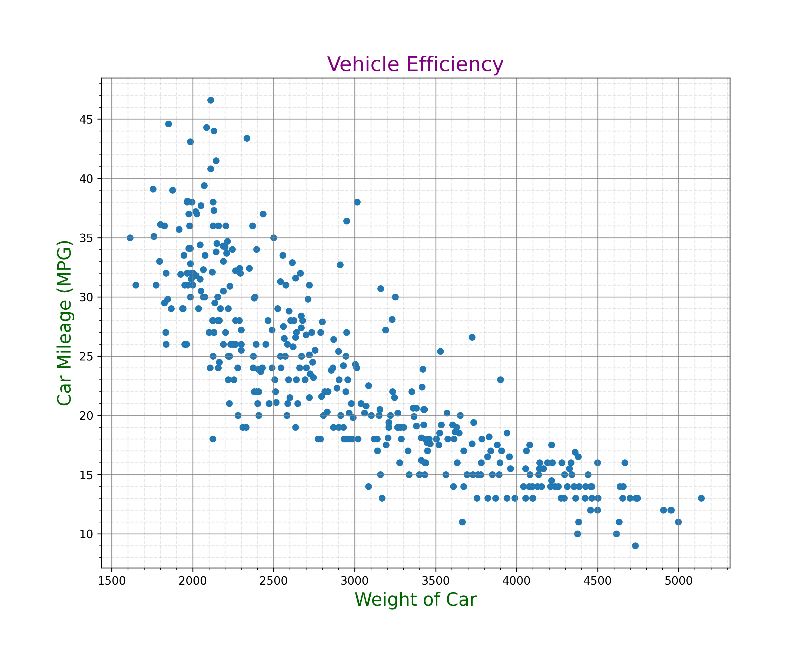
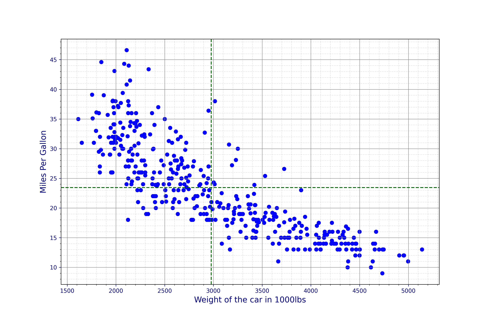
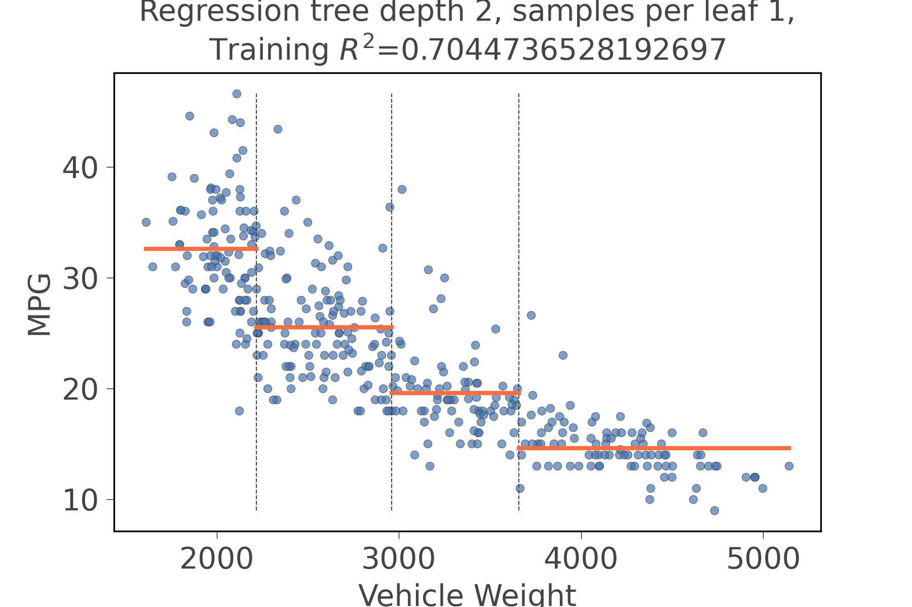
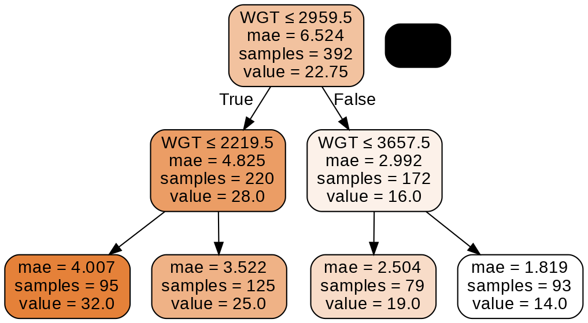

# Project 2: Concepts of Locally Weighted Regression and Random Forest

This in an analysis of a real data set that was extracted from the 1974 *Motor Trend US* magazine and comprises fuel consumption and 10 aspects of automobile design and performance for 32 automobiles (1973-1974 models). Below you will see the application of regression methods on the "Cars" data set where only one input variable, the weight of the car (WGT), was considered. The output varable is the mileage or MPG for the "Cars" data set. This is the methodology used for univariate regression analysis, where the relationship between one independent variable and one dependent variable is the focus. For each method and data set  the crossvalidated mean square error or mean absolute error was reported.

This scatterplot shows a fairly strong linear, negative slope of the bivariate data (weight and car mileage. Since the dots are close together, concentrated about a line, the linear relationship is strong.

mse_lwr = []
mse_rf = []
rf = RandomForestRegressor(n_estimators=150,max_depth=3)
kf = KFold(n_splits=10,shuffle=True,random_state=1234)
for idxtrain,idxtest in kf.split(x):
  ytrain = y[idxtrain]
  xtrain = x[idxtrain]
  xtrain = scale.fit_transform(xtrain.reshape(-1,1))
  ytest = y[idxtest]
  xtest = x[idxtest]
  xtest = scale.transform(xtest.reshape(-1,1))
  yhat_lwr = lowess_reg(xtrain.ravel(),ytrain,xtest.ravel(),tricubic,0.4)
  rf.fit(xtrain,ytrain)
  yhat_rf = rf.predict(xtest)
  mse_lwr.append(mse(ytest,yhat_lwr))
  mse_rf.append(mse(ytest,yhat_rf))
print('The MSE for Random Forest is :' + str(np.mean(mse_rf)))
print('The MSE for Locally Weighted Regression is :' + str(np.mean(mse_lwr)))

Output:
The MSE for Random Forest is :17.715139585974395
The MSE for Locally Weighted Regression is :17.509317956140727

Based upon this comparison of regression methods using mean-squared error (mse), Locally Weighted Regression (lowess) is achieving the better results. We know this because a lower mse indicates that the prediction is closer to the actual values of the data which is what we want.

This analysis shows us that vehichle efficiency is based upon the relationship between car weight and mileage. Considerations about automobile fuel consumption and environmental impacts (or car innovations to lessen such impacts) arise after establishing the strength of this relationship.

References:
“Univariate Linear Regression Tutorials &amp; Notes: Machine Learning.” HackerEarth, www.hackerearth.com/practice/machine-learning/linear-regression/univariate-linear-regression/tutorial/#:~:text=Univariate linear regression focuses on,obvious to the naked eye.
