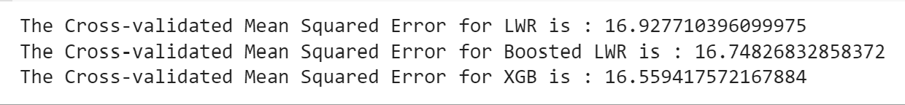

# Project 3: Concepts of Multivariate Regression Analysis and Gradient Boosting

This in an analysis of a real data set that was extracted from the 1974 *Motor Trend US* magazine and comprises fuel consumption and 10 aspects of automobile design and performance for 32 automobiles (1973-1974 models). For this analysis, the application of multivariate regression methods on the "Cars" data set were applied. Here, we considered engine, cylinder, and weight, as input variables ('ENG','CYL','WGT'). The output varable is the mileage, or 'MPG', for the "Cars" data set. This is the procedure used for a multivariate multiple regression analysis, where the relationship between multiple input variables and one dependent variable is the focus. For each method the crossvalidated mean square error or residual error was collected.

## Extreme Gradient Boosting (xgboost)


## Cars Output


```
The Cross-validated Mean Squared Error for LWR is : 16.927710396099975
The Cross-validated Mean Squared Error for Boosted LWR is : 16.74826832858372
The Cross-validated Mean Squared Error for XGB is : 16.559417572167884
```
The cars output shows that the lowest mean squared error belongs to the extreme gradient boosting method.
