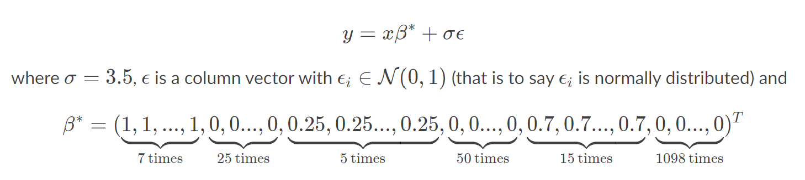
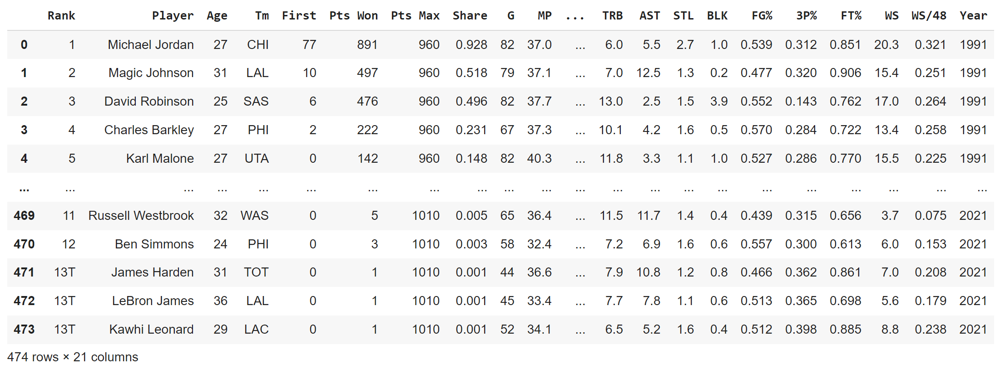
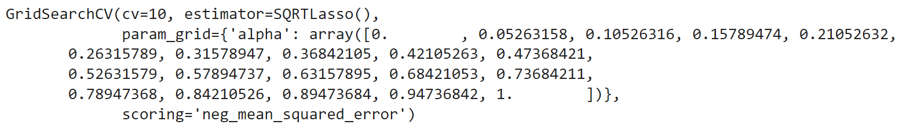

## Project 5: Comparison of Different Regularization and Variable Selection Techniques

In this project, different regularization techniques including Ridge, LASSO, Elastic Net, SCAD, and Square Root Lasso will be applied for comparison. Sklearn compliant functions for Square Root Lasso and SCAD are used in conjunction with GridSearchCV for finding optimal hyper-parameters when data such as x-bar and y-bar are given. Data is simulated 100 data sets, each with 1200 features, 200 observations and a toeplitz correlation structure.

```
# general imports for these methods
import numpy as np
import pandas as pd
from math import ceil
from scipy import linalg
from sklearn.preprocessing import StandardScaler
from sklearn.linear_model import LinearRegression, Ridge, Lasso, ElasticNet
from sklearn.metrics import mean_absolute_error
from sklearn.datasets import make_spd_matrix
import matplotlib.pyplot as plt
from scipy.linalg import toeplitz
from matplotlib import pyplot
# import an optimizer
from scipy.optimize import minimize
# the following is very important
from sklearn.base import BaseEstimator, RegressorMixin
from sklearn.metrics import mean_absolute_error as MAE, mean_squared_error as MSE
# import numba and jit
from numba import njit
```
The data for this project was found using kaggle.com. I used the NBA MVP dataset that holds NBA Stats from 1991-2021. I had trouble importing the csv because of the formatting but was able to resolve those issues using: ```df = pd.read_csv('drive/My Drive/Colab Notebooks/DATA 410/data/mvps.csv', sep=';', encoding='latin-1')```. This dataset looks like: 
```
y = df['FG%'].values.reshape(-1,1)
X = df[['PTS','TRB','FT%','STL','AST','MP']].values
``` 
As shown above, when specifying the parameters the Field Goal Percentage is what I set for y. For x parameters, I used points, total rebounds, free throw percentage, steals, assists, and minutes played (all NBA MVP statistics) to predict for y. I chose these parameters for x since these values are important for overall basketball game performance for a player. Not only are these statistics important for drafts and trading, but also play, initial recruitment, and of course Most Valuable Player Award selection. 

Grid Search output: 


model validation after gridsearch: 0.035639050632911395

model validation after SQRT Lasso: 0.0361251735886018

SCAD output:
```
array([-3.47457096e-20, -3.31713975e-20, -3.60433566e-20, -3.57863962e-20,
       -3.56467890e-20, -3.53998739e-20])
```
Based upon the outputs, I believe the smoothly clipped absolute deviation model is the best given the first few outputs in the result. Aside from the SCAD technique, gridsearch seems to be the next best model with a lower mse value for the MVP data


